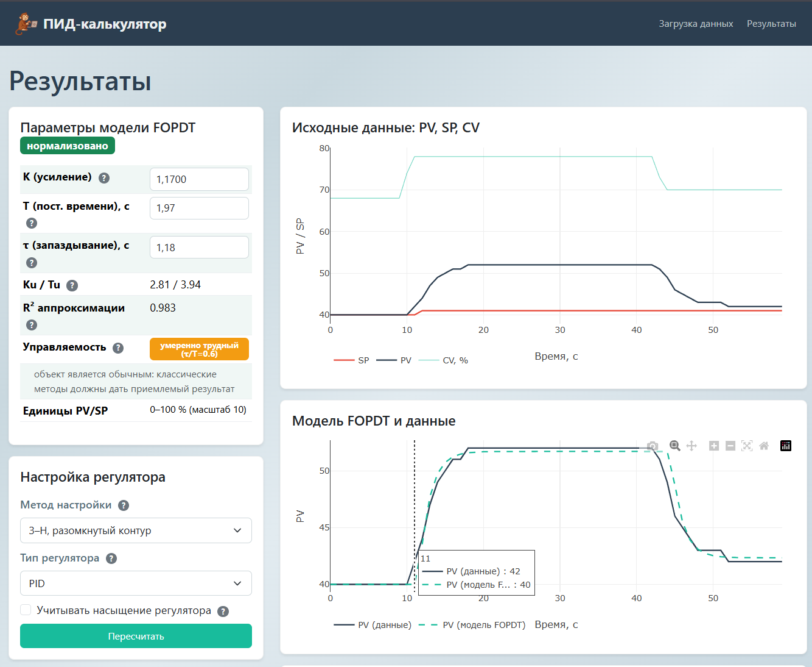

<h1 align="center">PID Calculator</h1>

<p align="center">
  Веб-приложение для автоматического расчёта PID-регулятора по данным процесса
</p>

<p align="center">
  
  
  
  
</p>

<p align="center">
  
</p>

---

## Описание

**PID Calculator** — это веб-приложение для автоматической идентификации процесса и подбора коэффициентов PID-регулятора (Kp, Ti, Td) по загруженным данным из CSV-файлов.

Приложение определяет **FOPDT-модель** (First Order Plus Dead Time) процесса и рассчитывает оптимальные параметры регулятора **11 методами** настройки, симулирует замкнутую систему и позволяет сравнить результаты всех методов в одном месте.

## Возможности

- **Загрузка CSV-данных** — поддержка форматов SCADA и простых таблиц с автоопределением разделителя, кодировки и маппинга колонок
- **Предобработка данных** — интерполяция на равномерную сетку, медианный фильтр шумов, детекция ступенчатых изменений
- **Идентификация FOPDT-модели** — метод ступенчатого отклика, аппроксимация методом наименьших квадратов, метод реле
- **11 методов настройки PID:**
  - Ziegler-Nichols (открытый и закрытый контур)
  - Cohen-Coon
  - Chien-Hrones-Reswick (4 варианта)
  - IMC (Internal Model Control)
  - SIMC (Skogestad IMC)
  - AMIGO
  - ITAE-оптимизация
- **Симуляция замкнутой системы** — точная ZOH-дискретизация, anti-windup, ограничение насыщения
- **Оценка управляемости** — классификация процесса (лёгкий / умеренный / сложный)
- **Экспорт отчётов** — PDF (с графиками и таблицами) и Excel
- **Встроенная справка** — описание теории PID, формулы всех методов (MathJax), рекомендации по выбору метода

## Технологии

### Backend
- **Python 3.10+** / Flask
- NumPy, SciPy, Pandas — вычисления и обработка данных
- Matplotlib, ReportLab — генерация PDF-отчётов
- OpenPyXL — генерация Excel-отчётов

### Frontend
- Bootstrap 5.3
- Plotly.js — интерактивные графики
- jQuery — AJAX-запросы
- MathJax — отображение формул

## Установка и запуск

### Требования

- Python 3.10+
- [uv](https://github.com/astral-sh/uv) (рекомендуется) или pip

### Вариант A — uv (рекомендуется)

```bash
git clone https://github.com/your-username/pid_calculator.git
cd pid_calculator
uv sync
uv run app.py
```

### Вариант B — pip

```bash
git clone https://github.com/your-username/pid_calculator.git
cd pid_calculator
python -m venv .venv
.\.venv\Scripts\Activate    # Windows
# source .venv/bin/activate  # Linux/Mac
pip install -r requirements.txt
python app.py
```

### Вариант C — Windows

Дважды кликните `run.bat` — скрипт автоматически установит зависимости и запустит сервер.

### Генерация тестовых данных

```bash
python scripts/generate_sample.py
```

Создаст 3 CSV-файла в папке `sample_data/` с синтетическими данными FOPDT-процесса.

Приложение будет доступно по адресу: **http://127.0.0.1:5943**

## Переменные окружения

| Переменная | По умолчанию | Описание |
|---|---|---|
| `PID_DEBUG` | `0` | Режим отладки Flask |
| `PID_HOST` | `0.0.0.0` | Адрес привязки |
| `PID_PORT` | `5943` | Порт сервера |
| `SECRET_KEY` | автогенерация | Секрет сессии Flask |

## Структура проекта

```
pid_calculator/
├── app.py                  # Точка входа Flask
├── config.py               # Конфигурация приложения
├── routes.py               # Маршруты и API
├── models.py               # Управление сессиями
├── core/                   # Вычислительный движок
│   ├── data_loader.py      # Загрузка и предобработка CSV
│   ├── identification.py   # Идентификация FOPDT-модели
│   ├── pid_tuning.py       # 11 методов настройки PID
│   └── simulator.py        # Симуляция замкнутой системы
├── reports/                # Генерация отчётов
│   ├── pdf_report.py       # PDF-отчёты
│   └── excel_report.py     # Excel-отчёты
├── templates/              # Jinja2 шаблоны HTML
├── static/                 # CSS, JS, изображения
├── scripts/                # Утилиты и тесты
├── sample_data/            # Тестовые CSV-файлы
├── pyproject.toml          # Метаданные проекта (PEP 621)
└── requirements.txt        # Зависимости pip
```

## Как использовать

1. **Загрузите CSV-файл** с данными процесса (PV, SP, CV)
2. Настройте параметры предобработки (интерполяция, фильтрация)
3. Выберите метод идентификации FOPDT-модели
4. На странице результатов просмотрите:
   - Графики исходных данных
   - Сравнение FOPDT-модели с реальными данными
   - Таблицу сравнения всех 11 методов настройки
   - Графики симуляции замкнутой системы
5. При необходимости отредактируйте параметры модели или коэффициенты PID вручную
6. **Экспортируйте отчёт** в PDF или Excel

## Лицензия

MIT License — см. [LICENSE](LICENSE)

## Автор

**Артемий "7Art" Семёнов** — [GitHub](https://github.com/SemonoffArt)
